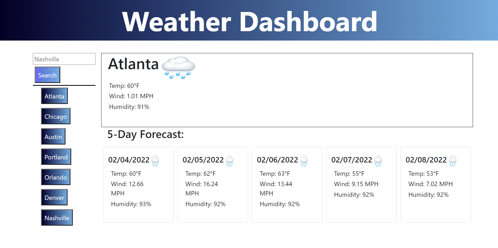

# Weather Dashboard

-[Description](#description) -[Purpose](#purpose) -[Usage](#usage) -[Mock-up](#) -[Credits](#credits) -[License](#license)

## Description

Weather Dashboard allows users to quickly search for the current and upcoming weather of a selected city.

## Purpose

Users can search any city that openweather API supports. Additionally this dashboard was created to practice dynamically updating html page elements using response info form an API.

## Usage

The live page can be found at: https://willhaberer.github.io/Weather-Dashboard/

## Mock-Up

## Credits

<a href="https://github.com/willhaberer" target="_blank">Will Haberer</a>

## License

MIT License

Copyright (c) [2022]
